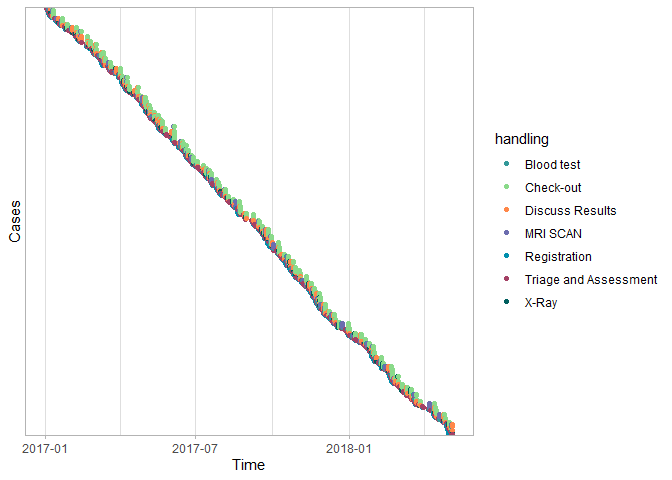

<!-- README.md is generated from README.Rmd. Please edit that file -->

# processmapR <a href="https://bupaverse.github.io/processmapR/"></a>

<!-- badges: start -->

[](https://CRAN.R-project.org/package=processmapR)
[](https://github.com/bupaverse/processmapR)
[](https://github.com/bupaverse/processmapR/actions/workflows/R-CMD-check.yaml)
[](https://app.codecov.io/gh/bupaverse/processmapR?branch=master)
[](https://lifecycle.r-lib.org/articles/stages.html#stable)
<!-- badges: end -->

**processmapR** is a [`R`](https://www.r-project.org/) package for
creating process maps. Part of the [bupaR](https://bupar.net/)
eco-system for business process analysis.

## Installation

You can install **processmapR** from [CRAN](https://cran.r-project.org/)
with:

``` r
install.packages("processmapR")
```

### Development Version

You can install the development version of **processmapR** from
[GitHub](https://github.com/) with:

``` r
# install.packages("devtools")
devtools::install_github("bupaverse/processmapR")
```

## Example

The [bupaR Documentation](https://bupaverse.github.io/docs/) website
contains more details on creating process maps using **processmapR**.

``` r
library(processmapR)
#> 
#> Attaching package: 'processmapR'
#> The following object is masked from 'package:stats':
#> 
#>     frequency
library(bupaR)
#> 
#> Attaching package: 'bupaR'
#> The following object is masked from 'package:stats':
#> 
#>     filter
#> The following object is masked from 'package:utils':
#> 
#>     timestamp

# Process map
patients %>%
  process_map()
#> PhantomJS not found. You can install it with webshot::install_phantomjs(). If it is installed, please make sure the phantomjs executable can be found via the PATH variable.
```

<figure>

<figcaption aria-hidden="true">process map</figcaption>
</figure>

``` r
# Dotted chart
patients %>%
  dotted_chart(x = "absolute", sort = "start")
```


